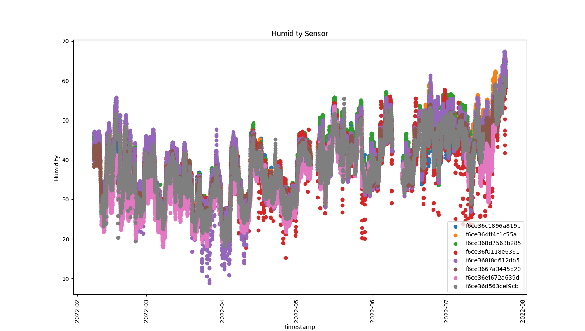

<h1 align="center">
  <a href="https://github.com/jpope8/synergia-datadrift-dataset">
    <!-- Please provide path to your logo here -->
    
  </a>
</h1>

<div align="center">
  SYNERGIA Datadrift Dataset.
  <br />
  <a href="#usage"><strong>Usage</strong></a> | <a href="#citing"><strong>Citing</strong></a>
  <br />
  <!--
  <br />
  <a href="https://github.com/jpope8/synergia-datadrift-dataset/issues/new?assignees=&labels=bug&template=01_BUG_REPORT.md&title=bug%3A+">Report a Bug</a>
  ·
  <a href="https://github.com/jpope8/synergia-datadrift-dataset/issues/new?assignees=&labels=enhancement&template=02_FEATURE_REQUEST.md&title=feat%3A+">Request a Feature</a>
  .
  <a href="https://github.com/jpope8/synergia-datadrift-dataset/issues/new?assignees=&labels=question&template=04_SUPPORT_QUESTION.md&title=support%3A+">Ask a Question</a>
  -->
</div>

<div align="center">
<br />

[](LICENSE)
[](https://github.com/jpope8/container-escape-analysis/issues?q=is%3Aissue+is%3Aopen+label%3A%22help+wanted%22)
[](https://github.com/jpope8)

</div>


## Contents

- [Introduction](#introduction)
- [Usage](#usage)
- [Citing](#citing)
- [License](#license)


---


## Introduction

This repository provides the following.

* Raw enviromenntal sensor data from a deployment in an indoor office area.
* Code to analyse the processed data.

## Installation

First create a virtual python environment.

```bash
python3 -m venv env-sdd
cd ./env-sdd
source ./bin/activate
```

Now clone the repository.

```bash
git clone git clone https://<git username>@github.com/jpope8/synergia-datadrift-dataset.git
(enter your git token)
```

The virtual environment only installs pip and python.  Install dependencies via the requirements.txt file.

This completes the installation.

## Usage

These instructions assume you have installed common Python analysis libraries using the provided requirements.txt (e.g. pandas, scikit-learn, numpy, tensorflow/keras, matplotlib).  Python3 is assumed and required.


For converting audit log to relational-interaction graph and displaying.

```bash
cd src
python parse.py 100 0.7
```

This will take some time as the zip files will be unzipped and read into series for display.  When finished, a plot will show for each sensor.

Buena Suerte.


## References
> - [1] This work was supported by UK Research and Innovation, Innovate
UK [grant number 53707].  SYNERGIA - Secure bY desigN End to end platfoRm for larGe scale resource constrained Iot Applications. [InnovateUK](https://gtr.ukri.org/projects?ref=53707) (last retrieved September 2021).

## License

This project is licensed under the **MIT License**.

See [LICENSE](LICENSE) for more information.
